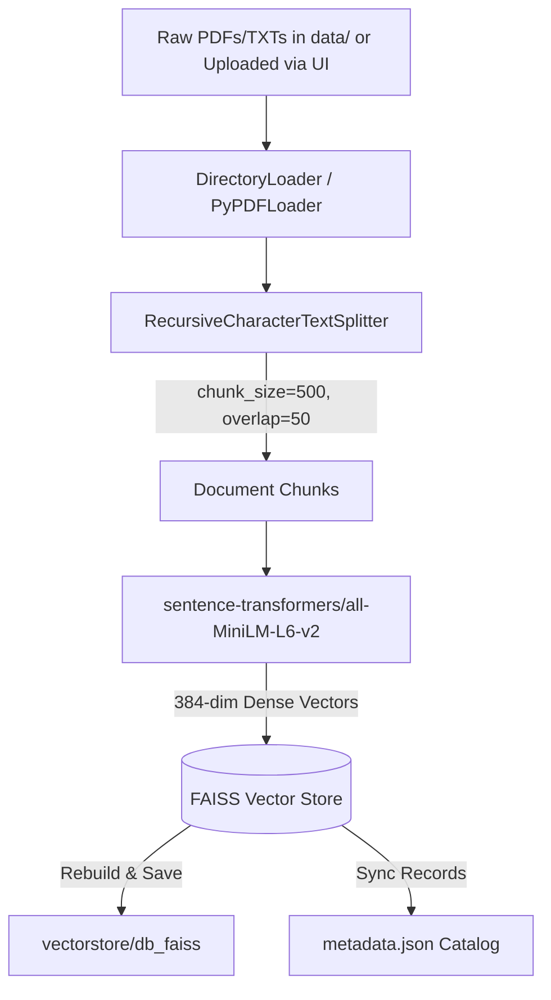
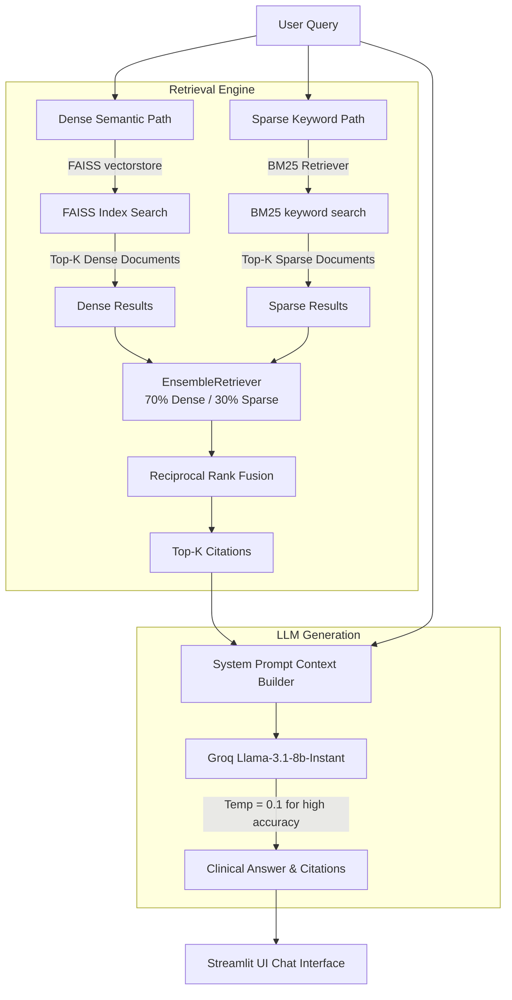

# 🧠 Medical GPT Workspace: Factual Clinical RAG Inference Engine

[](https://www.python.org/)
[](https://github.com/langchain-ai/langchain)
[](https://github.com/facebookresearch/faiss)
[](https://groq.com/)
[](https://streamlit.io/)

An enterprise-grade, local-first **Clinical RAG (Retrieval-Augmented Generation)** inference engine and dynamic knowledge ingestion workspace. Built with Streamlit, LangChain, FAISS (Dense Search), BM25 (Sparse Search), local HuggingFace embeddings, and the Groq API. 

This repository provides clinicians and researchers with a safe, factual, and fully auditable interface to query medical literature, load custom research on-the-fly, and control inference parameters to prevent hallucinations.

---

## 🗺️ Architectural Schematic Diagrams

### 1. Knowledge Ingestion Pipeline
This pipeline processes medical literature (PDF/TXT) asynchronously, converts it to numerical representations, builds dense indices, and registers the files in a metadata catalog.



### 2. Hybrid Retrieval & LLM Inference Pipeline
When a clinical query is submitted, the system performs a hybrid (dense + sparse) search, fuses results, builds a strict context, and queries the LLM under low-temperature controls.



---

## 🛠️ How We Did It (Technical Implementation)

The system consists of three main components: **Data Ingestion**, **Hybrid Search Retrieval**, and the **Interactive Web Application**.

### 1. Document Parsing & Chunking (`create_memory_for_llm.py`)
- **Loader**: LangChain's `DirectoryLoader` and `PyPDFLoader` load and extract pages from the PDF documents (defaulting to the **Gale Encyclopedia of Medicine**).
- **Chunking Strategy**: A `RecursiveCharacterTextSplitter` separates the text into small segments of `chunk_size=500` with an `chunk_overlap=50` characters. This short chunking size ensures specific clinical details (like drug dosages or symptom lists) are preserved without dilution from surrounding text.
- **Local Embedding Generation**: Chunks are passed to HuggingFace's local `sentence-transformers/all-MiniLM-L6-v2` model, creating 384-dimensional dense vectors.
- **Storage & Metadata Management**: The dense vectors are saved as a local **FAISS** index (`vectorstore/db_faiss`). A metadata JSON catalog (`vectorstore/metadata.json`) keeps track of file sizes, ingestion timestamps, and chunk counts for database synchronization.

### 2. Hybrid Retrieval & LLM Integration (`connect_memory_with_llm.py`)
- **Dense Retriever**: Leverages the local FAISS database for semantic meaning and conceptual matching (e.g., matching "chronic sugar disorder" to "Diabetes Mellitus").
- **Sparse Retriever**: Reconstructs a lexical document database using `BM25Retriever` to do exact keyword matching. This is crucial in medicine to find exact matches for rare drug names, abbreviations, and clinical codes.
- **Ensemble Fusion**: An `EnsembleRetriever` fuses the dense and sparse search results using a **70% semantic / 30% keyword** weight structure to output the most relevant contextual documents.
- **LLM Pipeline**: The retrieved context is stuffed into a custom system prompt template. The chain invokes a high-speed Groq model (`llama-3.1-8b-instant`) with the **temperature set to 0.1** to prioritize strict factual accuracy and eliminate speculative reasoning.

### 3. Asynchronous UI Engine (`medibot.py`)
- **Visual Design**: The UI features a premium dark theme stylesheet with custom glassmorphism containers (`backdrop-filter: blur(20px)`), glowing green accents, and a dynamic medical SVG/PNG vector background.
- **Asynchronous Ingestion Worker**: Streamlit runs on a single main thread, which would ordinarily lock up during file uploads. We implemented a multi-threaded **Ingestion Worker** (`threading.Thread`) that processes, chunks, and writes new documents in the background. An `IngestionTracker` provides real-time terminal-like console logging to the front end.
- **Inference Control Panel**: Sidebar sliders allow clinicians to fine-tune the LLM's temperature, maximum token lengths, the number of documents retrieved (Top-K), and toggle the Hybrid search on or off instantly.
- **Factual Citation & Verification**: Responses display a row of compact clickable source pills. Clicking them or expanding the details section displays the exact extracted snippets of text and page numbers from the source literature.

---

## 📂 Repository Structure

```directory
medical-rag-chatbot/
│
├── data/                             # Source document library
│   ├── The_GALE_ENCYCLOPEDIA_of_MEDICINE_SECOND.pdf # Default knowledge base
│   └── uploads/                      # User-uploaded files
│
├── vectorstore/                      # Indexed vector databases
│   ├── db_faiss/                     # FAISS binary index files
│   └── metadata.json                 # Ingested catalog database
│
├── create_memory_for_llm.py          # Vector ingestion script
├── connect_memory_with_llm.py        # Command-line query testing script
├── medibot.py                        # Streamlit web application
├── requirements.txt                  # Project package list
├── adapter.py                        # Bridge adapter for automated evaluations
├── .env                              # API credentials (ignored by git)
├── .gitignore                        # Git ignore file
├── pyproject.toml                    # UV environment configuration
└── README.md                         # Main documentation
```

---

## ⚡ Getting Started

### Prerequisites
- Python 3.10 or 3.11
- A [Groq API Key](https://console.groq.com/)

### Step 1: Clone & Configure Workspace
```bash
git clone https://github.com/jtnkpl/medical-rag-chatbot.git
cd medical-rag-chatbot
```

Create a `.env` file in the root directory and add your Groq API Key:
```env
GROQ_API_KEY=gsk_your_groq_api_key_here
```

### Step 2: Install Dependencies
You can install dependencies using **pip**:
```bash
pip install -r requirements.txt
```
*(Or use `pipenv install -r requirements.txt` if you are using Pipenv)*

### Step 3: Initialize the Vector Store
Before running the server, ingest the default Gale Encyclopedia PDF to build your initial FAISS index:
```bash
python create_memory_for_llm.py
```
This will parse the default PDF located in `data/`, generate embeddings locally, and save them in `vectorstore/db_faiss/`.

### Step 4: Run the Application
Start the Streamlit application:
```bash
streamlit run medibot.py
```

Open `http://localhost:8501` in your browser.

---

## 🛡️ Clinical Safety & Verification Guide

In clinical applications, model hallucinations can lead to unsafe outcomes. This workspace implements several safety mechanisms:

1. **Strict Context Constraints**: The system prompt instructs the LLM: *"If the answer cannot be inferred from the provided context, state that you do not know."* It restricts answers exclusively to the uploaded literature.
2. **Temperature Control**: Keep the `Temperature Tuning` slider in the sidebar set to **0.0 - 0.2**. Higher temperatures introduce creativity and speculation, which must be avoided for medical queries.
3. **Auditable Citations**: For every response generated, check the **Source Badges** at the bottom of the response. Expand the `Detailed Source Snippets` section to read the exact text extracted from the document to verify the AI's answer.
